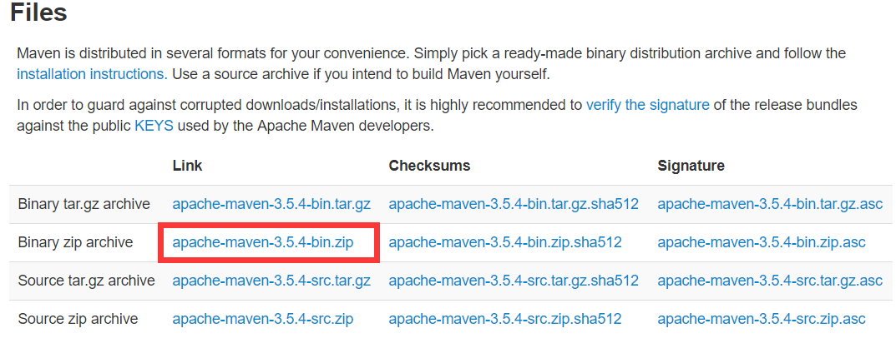
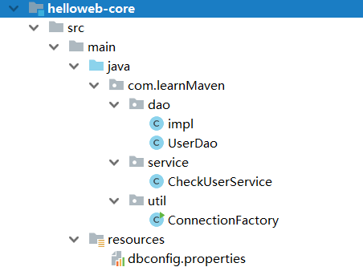

### Maven核心概念与运用

1. 概述

   Maven是一个项目管理工具，提供构建的功能，还能提供代码的静态检查等

2. 功能

   - 构建项目(Builds)
   - 依赖管理
   - 配置管理
   - 发布管理
   - 文档编制
   - 报告

3. 特点

   - 微内核：大多数功能委派给插件来做，内核主要解析xml等
   - 约定优于配置
   - 项目模型

4. Windows安装

   - http://maven.apache.org 下载压缩包

     

   - 拷贝压缩包到指定目录并解压

   - 环境变量

     - 新建 M2_HOME，值为安装目录
     - PATH，值为%M2_HOME%\bin

   - mvn --version

5. 命令行构建Maven项目

   ```powershell
   mvn archetype:generate
   //根据模板创建 配置groupID 等
   mvn package
   //打包 在根目录下target文件夹中生成jar
   ```

6. POM概述

   POM是Project Object Model的缩写。项目的属性，依赖，构建配置这些信息都被抽象到项目对象模型里面。

   

   * POM组成
     * 项目基本信息
     * 构建环境
     * POM关系
     * 构建设置
   * 大型项目的子项目都会有POM继承父项目的POM，通过父项目的POM可以构建整个项目

7. 插件和目标

   `mvn archetype:generate`执行archetype的generate目标

   * 调用插件目标的方式
     * 将插件目标与生命周期绑定，执行生命周期
     * 直接执行插件目标

8. 项目的生命周期阶段

   maven中项目的生命周期是指项目的构建过程，它包含一系列有序的阶段，而一个阶段就是构建过程中的一个步骤

   install之后其他项目可以引用本项目的构建

9. web项目

   1. 创建web项目

      * `mvn archetype:generate``
      * ``web`过滤
      * 选择一个模板输入各种配置
      * `mvn package`
      * war包放入tomcat的webapp下
      * 启动tomcat

   2. 添加tomcat插件

      * pom.xml

        ```xml
        <plugin>
          <groupId>org.apache.tomcat.maven</groupId>
          <artifactId>tomcat7-maven-plugin</artifactId>
          <version>2.2</version>
        </plugin>
        ```

      * 运行

        tomcat7:`mvn tomcat7:run`

      * 查看

        http://localhost:8080/helloweb/

   3. Jetty插件

      与tomcat不同，是直接布置到根目录下

      * pom.xml

        ```xml
        <plugin>
          <groupId>org.mortbay.jetty</groupId>
          <artifactId>jetty-maven-plugin</artifactId>
        </plugin>
        ```

      * 运行

        `mvn jetty:run`

      * 查看

        http://localhost:8080/

10. 多模块项目

  1. 创建项目（helloweb）

  2. 项目中新建多个子模块的文件夹

     * helloweb-core
     * helloweb-entity
     * helloweb-parent
     * helloweb-web

  3. 将helloweb下的src目录与pom文件拷贝至各个模块中

  4. 删除父目录(helloweb)的src

  5. 修改父目录的pom文件

     ```xml
     <project xmlns="http://maven.apache.org/POM/4.0.0" xmlns:xsi="http://www.w3.org/2001/XMLSchema-instance"
       xsi:schemaLocation="http://maven.apache.org/POM/4.0.0 http://maven.apache.org/xsd/maven-4.0.0.xsd">

       <!--用来说明当前项目的pom文件遵循哪一个pom模型的版本-->
       <modelVersion>4.0.0</modelVersion>

       <groupId>com.learnMaven</groupId>
       <artifactId>helloweb</artifactId>
       <version>1.0-SNAPSHOT</version>
       <!--war jar(默认值) ear pom(表示当前标签是一个父项目)-->
       <packaging>pom</packaging>

       <name>helloweb</name>

       <modules>
         <module>helloweb-core</module>
         <module>helloweb-entity</module>
         <module>helloweb-parent</module>
         <module>helloweb-web</module>
       </modules>

     </project>

     ```

  6. 修改单个模块中的pom文件

     * helloweb-parent

       ```xml
       <groupId>com.learnMaven</groupId>
       <artifactId>helloweb-parent</artifactId>
       <version>1.0</version>
       <packaging>pom</packaging>
       <name>helloweb< parent/name>

       ```

     * 其他模块

       ```xml
       <parent>
         <groupId>com.learnMaven</groupId>
         <artifactId>helloweb-parent</artifactId>
         <version>1.0</version>
         <relativePath></relativePath>
       </parent>

       <artifactId>helloweb-core</artifactId>
       <packaging>jar</packaging>

       <name>helloweb core</name>
       ```

  7. dependencyManagement

     Maven使用dependencyManagement元素来提供一种管理依赖版本号的方式（父项目中添加dependencyManagement指定具体依赖，子项目中不需要指定具体版本号）

     **dependencyManagement只声明依赖，不会实现引入，子项目需要显示声明**

     * helloweb-parent

       ```xml
       <dependencyManagement>
         <dependencies>
           <dependency>
             <groupId>junit</groupId>
             <artifactId>junit</artifactId>
             <version>3.8.2</version>
           </dependency>
       </dependencyManagement>
       ```

     * helloweb-entity

       不写版本号，构建（install）成功

       ```xml
       <dependencies>
           <dependency>
               <groupId>junit</groupId>
               <artifactId>junit</artifactId>
           </dependency>
       </dependencies>
       ```

  8. 使用 pluginManagement 管理插件

     不会影响插件行为，只有子模块配置后才会

     * helloweb-parent

       ```xml
       <build>
         <pluginManagement>
           <plugins>
             <plugin>
               <groupId>org.apache.maven.plugins</groupId>
               <artifactId>maven-compiler-plugin</artifactId>
               <version>2.3.2</version>
               <configuration>
                 <source>1.7</source>
                 <target>1.7</target>
                 <encoding>UTF-8</encoding>
               </configuration>
             </plugin>
           </plugins>
         </pluginManagement>
       </build>
       ```

  9. 定义项目属性及配置信息

     * properties定义一些常量

       helloweb-parent

       ```xml
       <properties>
         <jdk.version>1.7</jdk.version>
         <servet.api.version>3.0.1</servet.api.version>
         <jsp.api.version>2.1</jsp.api.version>
         <junit.version>4.11</junit.version>
         <mysql.version>5.1.21</mysql.version>
         <project.build.sourceEncoding>UTF-8</project.build.sourceEncoding>
       </properties>
       ```

       引用

       ```xml
       <dependency>
         <groupId>javax.servlet</groupId>
         <artifactId>javax.servlet-api</artifactId>
         <version>${servet.api.version}}</version>
         <scope>provided</scope>
       </dependency>
       ```

     * description

       定义项目描述信息

     * url

       项目的起始地址

     * inceptionYear

       项目的起始年份

  10. 完善helloweb-entity模块

    * 数据库

      1. 创建schema：maven_db

      2. 建表及测试

         ```sql
         create table tbl_user(
         id int(11) unsigned not null auto_increment,
         name varchar(50) not null,
         password varchar(50) not null,
         email varchar(50),
         primary key(id))engine=InnoDB default charset=utf8;

         insert into tbl_user(name,password,email) values('TOM','123456','T@WIN.COM');

         select * from tbl_user;
         ```

      3. 模块骨架

         

      4. 配置文件

         ```properties
         driver=com.mysql.cj.jdbc.Driver
         dburl=jdbc:mysql://localhost:3306/maven_db
         user=root
         password=123
         ```

      5. 配置pom文件

         ```xml
         <name>helloweb core</name>
         <dependencies>
           <dependency>
             <groupId>mysql</groupId>
             <artifactId>mysql-connector-java</artifactId>
           </dependency>

           <!--entity引入-->  
           <dependency>
               <groupId>com.learnMaven</groupId>
               <artifactId>helloweb-entity</artifactId>
               <version>1.0</version>
           </dependency>
           <!--entity引入后，
         	helloweb core中可以import com.learnMaven.entity.*;-->  
           
         </dependencies>
         ```

      6. ConnectionFactory.java

         ```java
         package com.learnMaven.util;
         import java.io.InputStream;
         import java.sql.Connection;
         import java.sql.DriverManager;
         import java.sql.SQLException;
         import java.util.Properties;
         import java.util.Scanner;
         /**
          * Created by 马昕 on 2018/10/26.
          */
         public class ConnectionFactory {
             private static String driver;
             private static String dburl;
             private static String user;
             private static String password;
             private static final ConnectionFactory factory=new ConnectionFactory();
             private Connection connection;
             static {
                 Properties properties=new Properties();
                 try {
                     InputStream in=ConnectionFactory.class.getClassLoader().getResourceAsStream("dbconfig.properties");
                     properties.load(in);
                 }catch (Exception e){
                     e.printStackTrace();
                 }
                 driver=properties.getProperty("driver");
                 dburl=properties.getProperty("dburl");
                 user=properties.getProperty("user");
                 password=properties.getProperty("password");
             }
             private ConnectionFactory(){
             }
             public static ConnectionFactory getInstance(){
                 return factory;
             }
             public Connection makeConnection() {
                 try {
                     Class.forName(driver);
                     connection= DriverManager.getConnection(dburl,user,password);
                 }catch (Exception e){
                     e.printStackTrace();
                 }
                 return connection;
             }
             public static void main(String[] args) throws SQLException {
                 Connection connection=ConnectionFactory.getInstance().makeConnection();
                 System.out.println(connection.getAutoCommit());
             }
         }
         ```

